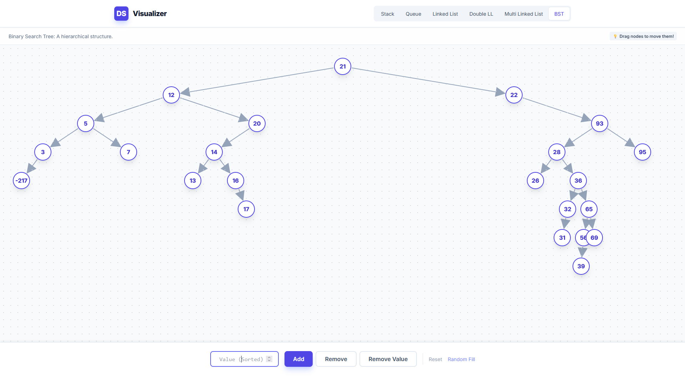

# Data Structure Final Project



## Overview
This project is a visualization tool for various data structures. It provides an interactive and educational platform to understand the inner workings of fundamental data structures. It is is ideal for students, educators, and anyone interested in learning data structures in a visual and engaging way.

## Features
The project includes visualizations for the following data structures:

- **Stack**: Demonstrates push, pop, and peek operations.
- **Queue**: Visualizes enqueue and dequeue operations.
- **Singly Linked List**: Shows insertion, deletion, and traversal.
- **Doubly Linked List**: Illustrates bidirectional traversal and operations.
- **Multi-Linked List**: Represents complex linked structures with multiple pointers.
- **Binary Search Tree (BST)**: Displays insertion, deletion, and in-order traversal.

## Technologies Used
- **C++**: Core programming language for implementing data structures.
- **Crow Framework**: A C++ micro web framework used to create the web server for visualization.
- **HTML/CSS**: For creating templates and visual interfaces.

## How to Run
1. Clone the repository:
   ```bash
   git clone https://github.com/rafiathallah3/DataStructureFinalProject.git
   ```
2. Open the project in Visual Studio.
3. Build the solution to compile the code.
4. Run the application to start visualizing data structures.

